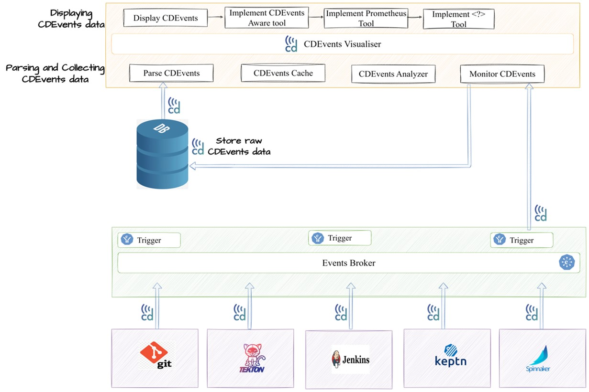

# CDEvents Visualisation Reference Implementation

CDEvents Visualisation reference implementation helps to visualise the end-end CI/CD workflow with different types of visualisations.
    
    1. CDEvents aware tool (Eiffel based)
    2. Generic tool (Prometheus/Grafana)

The CDEvents Visualization Reference Implemnetaiton is build upon CDEvents Proof of Concept, that is created by CDEvents contributors to show the interactions between different CI/CD tools Tekton, Keptn and Spinnaker. In the PoC Tekton executes the Pipeline to build the artifact, Keptn handles the business decision and Spinnaker running the Pipeline to deploy the artifact. More information about the PoC can be found on the [CDEvents PoC GitHub](https://github.com/cdfoundation/sig-events/tree/main/poc).


## CDEvents aware tool
CDEvents aware tool knows what exactly is CDEvent and it creates sequences and aggregation graph of the events produced by PoC.

## Generic tool (Prometheus/Grafana)
Generic tool like Prometheus/Grafana can consume a specific event format which is translated from CDEvents to show the tracking and monitoring of an end-end workflow of CDEvents PoC.

## Visualisation Reference Architecture


## Visualisation PoC Use Case
Visualisation PoC follows the same Use Case as CDEvents PoC and shows visualization of CI/CD workflow.

The use case showcased by the PoC can be summarized as follows:

1. A new version of a container is built by Tekton.
2. Keptn is informed by this new build.
3. Keptn decides what to do next following its orchestration manifest.
4. Keptn sends out a request for the next operation to be started. (In the PoC, the next operation will be deployment of the container.)
5. Spinnaker recieves the request and runs the deployment pipeline.
6. Keptn is informed that the operation is completed.

## How to Run Visualisation PoC
1. Install [CDEvents PoC](https://github.com/cdfoundation/sig-events/tree/main/poc), with Spinnaker by running 
````sh
./poc.sh -s
````
2. Clone [CDEvents Visualisation Repo](https://github.com/cdevents/visualisation) and run `./deploy_visualiser.sh` under `poc/cdevents-visualiser`
3. Deploy Prometheus/Grafana visulaization tool by running `./deploy_grafana_visi.sh` under `poc/python-poc`
4. Deploy CDEvents aware tool (Eiffel based) by running the below commands
````sh
git clone git@github.com:Nordix/eiffel-vici.git cdevents-visi
cd cdevents-visi
git checkout CDEvents_Demo
./deploy_cdevents_visi.sh
  ````
5. To kick off the demo, from the [CDEvents PoC](https://github.com/cdfoundation/sig-events/tree/main/poc) folder, run tkn command:
````sh
tkn pipeline start build-artifact -w name=sources,volumeClaimTemplateFile=./tekton/workspace-template.yaml
````